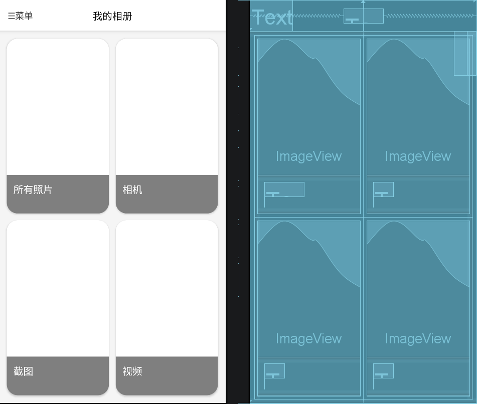
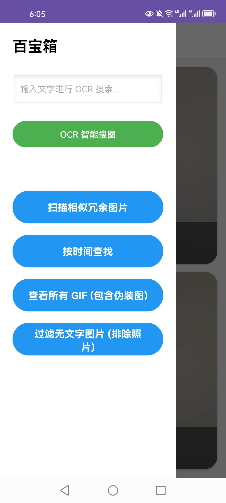
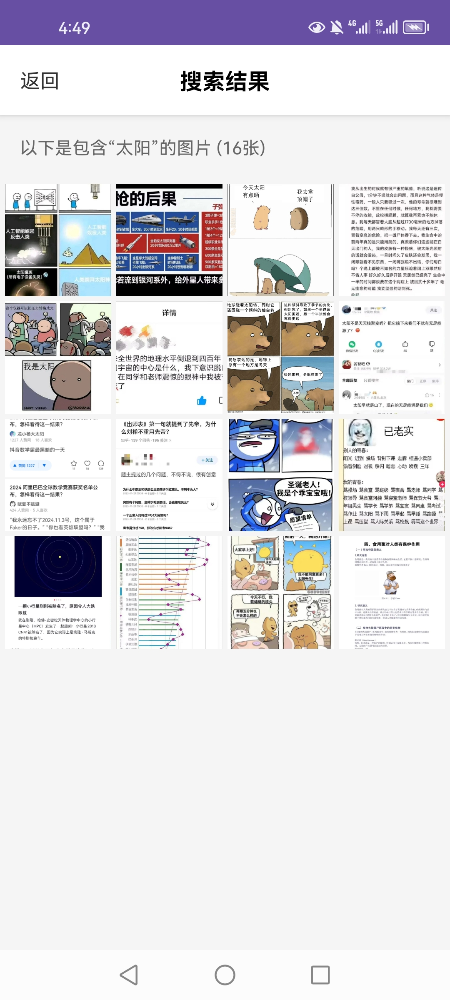

# MyPic - 纯本地智能相册引擎 (Smart Local Gallery)


MyPic 是一款主打**隐私安全**与**极速检索**的 Android 本地智能相册应用。基于设备端原生算力，在无需任何网络连接的情况下，实现毫秒级的图片 OCR 全文检索、精准相似图清理、以及深度文件过滤。

## 📸 应用截图


<div align="center">
  
</div>

<br>

<div align="center">
  <table align="center" width="100%">
    <tr>
      <th align="center">百宝箱工具页</th>
      <th align="center">智能 OCR 搜索结果</th>
    </tr>
    <tr>
      <td align="center" width="50%">
        
      </td>
      <td align="center" width="50%">
        
      </td>
    </tr>
  </table>
</div>

## ✨ 核心特性与工程亮点 (Features & Engineering Highlights)

### 1. 🔍 离线 OCR 极速全文搜索
* **引擎底层：** 深度集成 **Baidu PaddleOCR v4** 轻量级端侧模型。
* **长图切片算法 (Sliding Window)：** 针对长截屏导致 OCR 降采样糊图的问题，在 Java 层自研“带重叠区动态切片”策略，突破长图识别瓶颈。
* **抗混叠插值强化：** 针对加粗文字/小字粘连问题，在送入模型前实施基于 `Matrix` 的双线性平滑插值放大 (1.5x)，大幅提升极限场景识别率。
* **闪电建库：** 结合 Room 数据库进行增量扫描与后台静默建库，实现万张图片毫秒级文字检索。

### 2. 🧹 高精度相似/冗余图清理
* **感知哈希 (pHash) + 汉明距离：** 提取图片 256 位结构指纹，容忍社交软件的轻微变色压缩。
* **长宽比物理防火墙：** 针对高频图（漫画、文字梗图）压缩导致的哈希位翻转问题，引入 `AspectRatio` 绝对防火墙，并在极低耗时下实现了 90% 阈值的精准相似度聚类。

### 3. 🛡️ 降维打击的文件过滤器
* **无字纯图提取：** 结合底层数据库 Set 求差集与物理路径黑名单（穿透社交软件分身图），极速精准过滤表情包与风景照。
* **真伪动图嗅探：** 不依赖文件后缀，直接通过魔数与 `mimeType` 穿透沙盒，精准揪出被篡改后缀的 WebP 伪装动图。

## 🛠️ 技术栈 (Tech Stack)
* **语言：** Java
* **AI 视觉引擎：** Paddle Lite, PaddleOCR v4, OpenCV
* **本地存储：** Android Room (SQLite)
* **图片加载：** Glide
* **异步调度：** 线程池 (ExecutorService)

## 🚀 快速体验 (Download & Install)
你可以直接在 [Releases 页面](https://github.com/你的用户名/项目名/releases) 下载最新版的 APK 文件进行安装体验。
*(注意：首次冷启动会在后台建立 OCR 与动图索引，图片较多时请耐心等待几分钟，后续均为毫秒级静默刷新。)*

## 💻 编译运行指南 (Build Setup)
1. 确保你的 Android Studio 版本为 Arctic Fox 或更高。
2. 克隆本仓库：
   ```bash
   git clone https://github.com/g-o-d-v/MyPic-SmartGallery.git